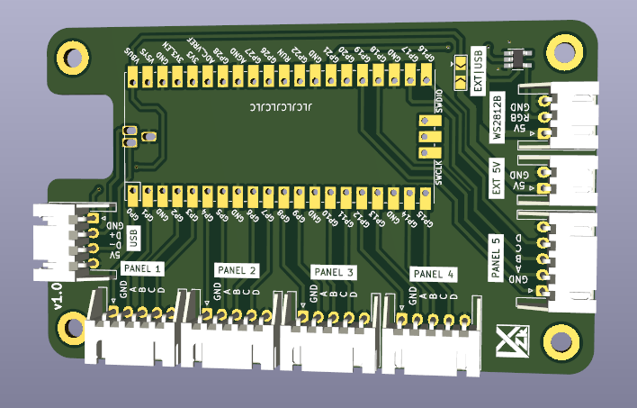
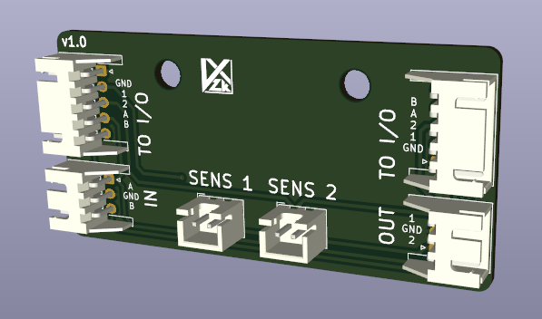

# Pump AC Conversion

This repo contains files for my hyper-specific desire to get rid of all the rusted metal and busted sensors from my Pump It Up arcade pads.

It features the odd choice to keep bracketed panels, due to cost. In the future, I may modify the files to also support bracketless panels.

## Code

The code is designed around RP2040. Install the [arduino-pico](https://github.com/earlephilhower/arduino-pico) core and compiled using the [Arduino IDE](https://www.arduino.cc/en/software). 

At the top of the code lists `panelPins`, an array grouping 4 pins for each of the 5 panels. You can change these if you are not using the boards as I've designed.
```c
int panelPins[5][4] =
  {
    {0, 1, 2, 3},
    {4, 5, 6, 7},
    {8, 9, 10, 11},
    {12, 13, 14, 15},
    {16, 17, 18, 19}
  };
```

This code is simplistic. There's no debounce. If any switch is triggered, it will trigger the entire panel.

## CAD

New frames were designed to be 3D printed (as all of mine were rusted). They are designed to use the existing bracketed panels and replaces the sensors with [cheap generic dance sensors](https://rhythm-cons.wiki/controllers/dance-pads/dance-pads/#sensors). 

CAD will be published soon(tm).

## Boards

Two boards are contained in this repo.

### Pad Board

The pad board takes a Raspberry Pi Pico as the main microcontroller, and has several JST XH connectors to mate with the connector boards, discussed below. There's also another JST XH connector for a WS2812B output, and for USB input.



### Connector Boards

The connector boards are designed to screw into the area where the L-Bracket is mounted. Two are required for each panel. Each daughter board has (2) JST XH 2P connectors for the generic dance sensor, (2) JST XH 3P connectors for linking two connector boards together (OUT on one board goes to IN on the other), and (2) JST XH 5P connectors to bring signals back to the pad board (only one is necessary to use, but both are included for easier wire routing.

